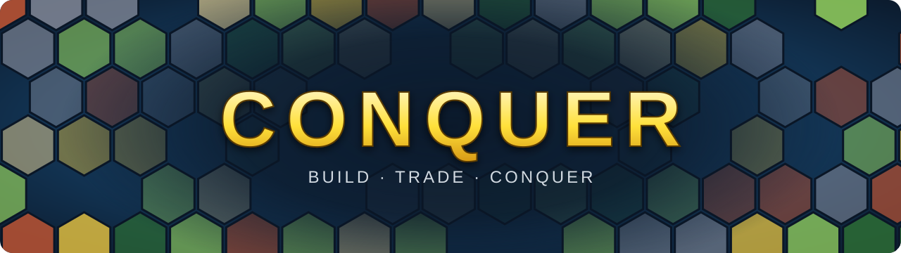
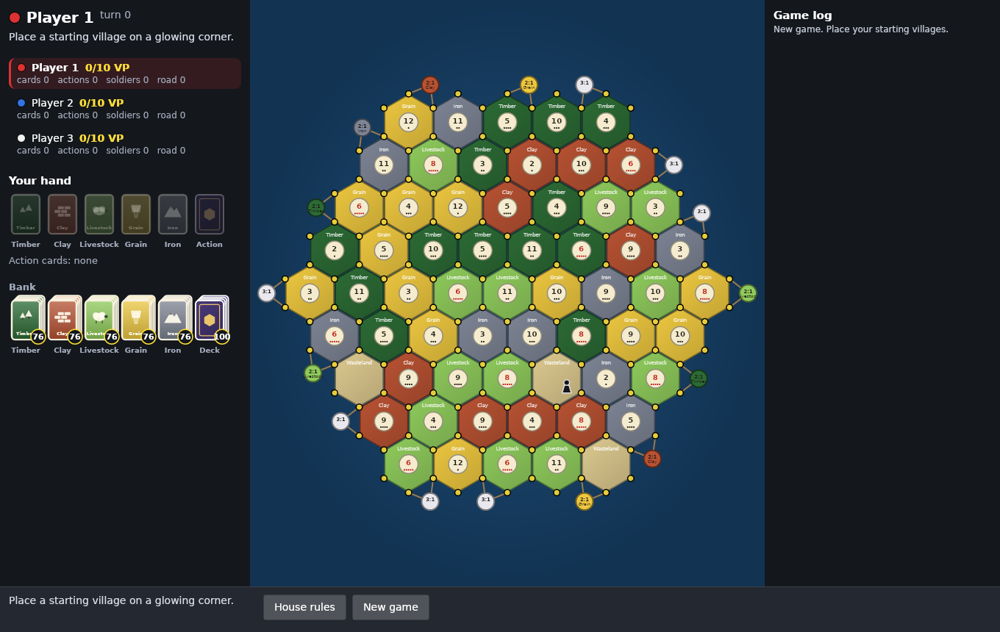
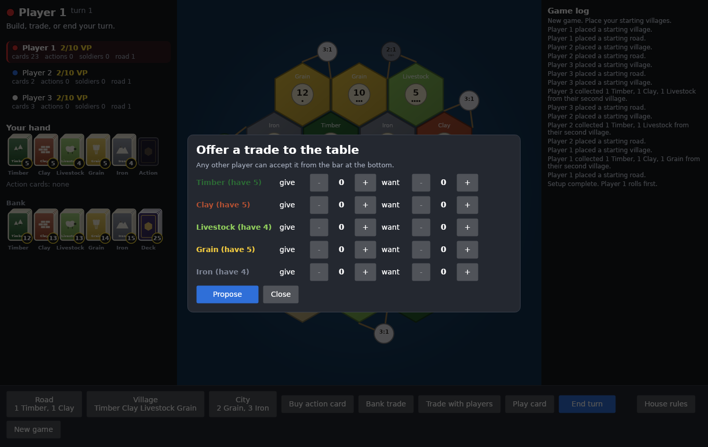

  

  <b>A hex-board strategy game of building, trading and conquest for Windows.</b> 
  Claim the land, grow your villages into cities, out-trade your rivals and be first to 10 points.

  

  
  
  
  

  <a href="#features">Features</a> ·
  <a href="#install">Install</a> ·
  <a href="docs/HOW_TO_PLAY.md">How to play</a> ·
  <a href="#play-online">Play online</a> ·
  <a href="docs/DEVELOPMENT.md">Build from source</a> ·
  <a href="CHANGELOG.md">Changelog</a>

## Features

- **A new world every game.** Every board is generated fresh: shuffled terrain, number tokens and harbors, with the
  hottest numbers kept apart. Play the standard 19-tile island or scale it up to a sprawling map of more than 100 tiles.
- **Single player against the computer.** Up to five computer opponents at Easy, Normal or Hard. Hard players plan
  their roads, chase the Grand Army and play their action cards at the right moment.
- **Pass and play.** Friends can share one screen; hands are hidden between turns so nobody peeks.
- **Online with friends.** Create a room, share the code and play over the internet with built-in chat. The server
  deals every card and rolls every die, so nobody can cheat, and a dropped player can rejoin their seat.
- **House rules, any time.** Change the points needed to win, trade ratios, discard limits, a friendly raider and
  more, even in the middle of a game. Spice up the action deck with wild cards like *Golden Crown*, *Plague* and
  *Earthquake*.
- **Made to feel alive.** Tumbling dice, resource cards that fly from the land to your hand, action cards that flip
  as you draw them, pieces that pop onto the board, and a victory screen worth winning for.

  
  

## Install

1. Download **[ConquerSetup.exe](https://github.com/HuskoTheGreat/ConquerGameWindows/releases/download/game-latest/ConquerSetup.exe)**.
2. Run it. It needs no admin rights and no .NET install, and adds Start menu and desktop shortcuts.
3. Launch **Conquer**.

The game keeps itself up to date: every time it starts it checks for a newer build, downloads and verifies it, and
then plays. Offline, it simply starts the last version you had.

> Windows SmartScreen may warn about an unrecognized app the first time, because the installer isn't code-signed
> yet. Choose **More info**, then **Run anyway**.

## How to play

On your turn you roll the dice, every tile showing that number pays its resource to the villages and cities around
it, and then you build, trade and play cards. Roads claim new ground, villages earn 1 point, cities earn 2, and the
first player to 10 points wins.

The full rules, building costs and every action card are in **[How to play](docs/HOW_TO_PLAY.md)**.

## Play online

Choose **Online** on the title screen, type the server's address and your name, then either create a room and
share its code or join a friend's. The host picks the board size and points to win and starts the game once
everyone is in. Online games need at least two people; computer opponents are single player only for now.

Want to host your own server? It runs comfortably on a free cloud VM; see the [server guide](server/README.md).

## Roadmap

- Sound effects and music
- Turn timers and letting the host remove a player
- Computer players in online rooms, and bots that propose trades
- Voice chat

Ideas and bug reports are welcome in [Issues](https://github.com/HuskoTheGreat/ConquerGameWindows/issues).

## For developers

Conquer is written in C# on .NET 8 with an [Avalonia](https://avaloniaui.net/) client, a UI-free rules engine and an
ASP.NET Core WebSocket server, covered by over 200 automated tests. See **[docs/DEVELOPMENT.md](docs/DEVELOPMENT.md)**
to build, run and test it, and [docs/NETWORKING.md](docs/NETWORKING.md) for the online design and threat model.
